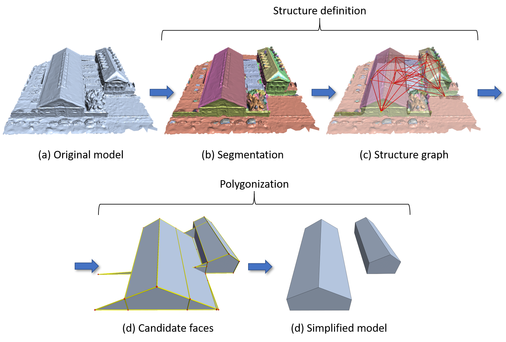

# MeshPolygonization
## Introduction

MeshPolygonization is the implementation of the MVS (Multi-view Stereo) building mesh simplification method described in the following [paper](https://www.sciencedirect.com/science/article/pii/S0924271620301969):
```
Vasileios Bouzas, Hugo Ledoux, and  Liangliang Nan.
Structure-aware Building Mesh Polygonization. 
ISPRS Journal of Photogrammetry and Remote Sensing. 167(2020), 432-442, 2020.
```
Please consider citing the above paper if you use the code/program (or part of it). 

---

The main characteristic of this method is structure awareness — namely, the recovery and preservation, for the input mesh, of both its primitives and the interrelationships between them (their configuration in 3D space). This awareness asserts that the resulting mesh closely follows the original and at the same time, dictates the geometric operations needed for its construction in the first place — thus providing accuracy, along with computational efficiency.

The proposed methodology is divided into three main stages: (a) primitive detection via mesh segmentation, (b) storage of primitive interrelationships in a structure graph and (c) polygonization. In particular, polygonization is accomplished here by approximating the primitive borders with a building scaffold, out of which a set of candidate faces is defined. The selection of faces from the candidate set to form the simplified mesh is achieved through the formulation of a linear binary programming problem, along with certain hard constraints to ensure that this mesh is both manifold and watertight.



## Dependencies
The program was written in C++ (with C++11 functionalities) and compiled in Visual Studio 2017. This implementation is dependent on the following list of libraries:

* [CGAL v4.13](https://www.cgal.org/)
* [RPly](http://w3.impa.br/~diego/software/rply/)

The solver needed for the optimization process are provided along with our implementation.

## Structure
This repository is structured as follows:
* **MeshPolygonization**: Contains our implementation of Structure-aware Mesh Polygonization
  The results for each step of our methodology are exported in the following paths:
  - /data: Here, you can place the meshes you wish to simplify in **.obj** format
  - /outputs: Contains the results of our segmentation tecnhique. Basically, a .ply mesh enhanced with various properties (planarity,           chart etc.)
  - /graphs: The structure graph for each processed model are exported here in .ply format
  - /simplified: The final, simplified version for each processed model can be accessed through here
* **meshes**: We provide some example meshes to test the implementation
* **proj**: The project files from Visual Studio
* **3rd_scip, 3rd_soplex, solver**: The solver for the optimization process, along with its dependencies.
